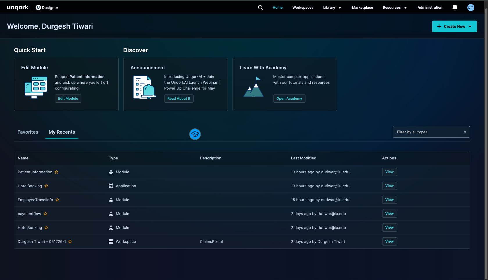
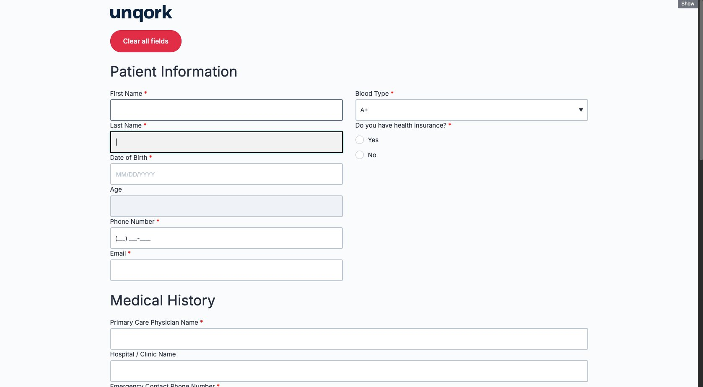
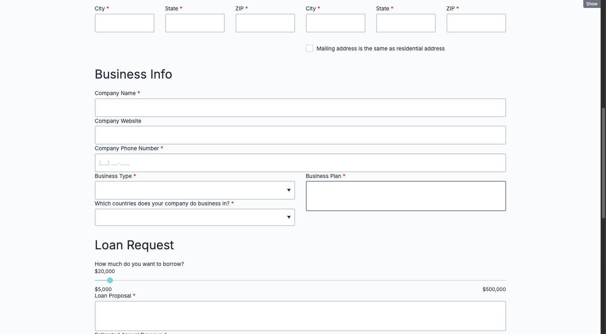
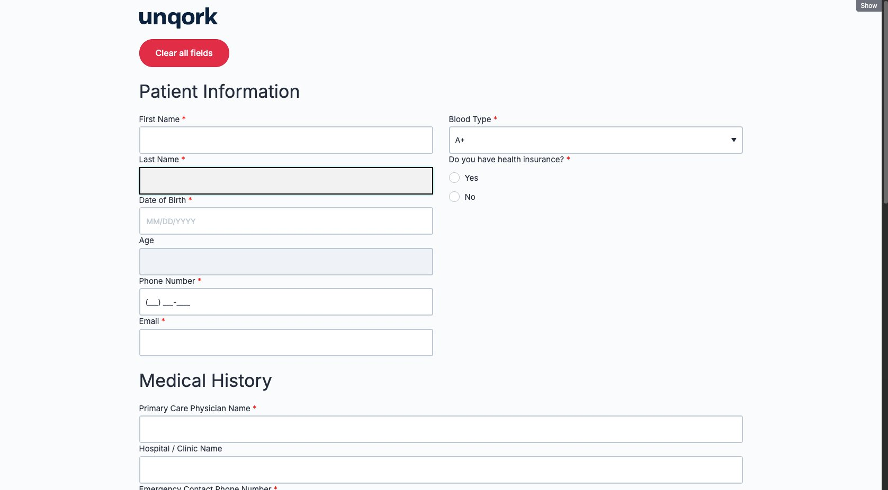
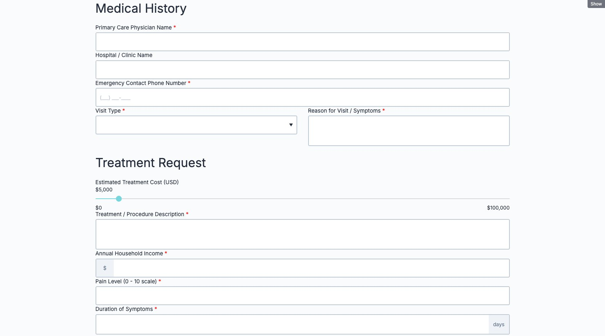
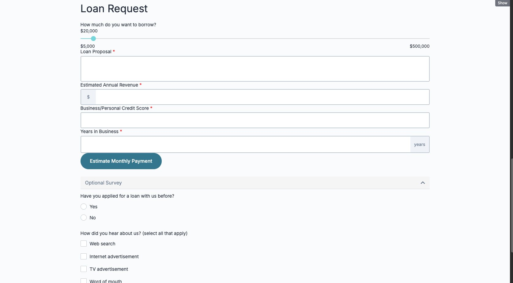
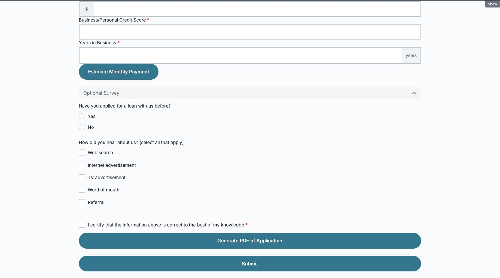
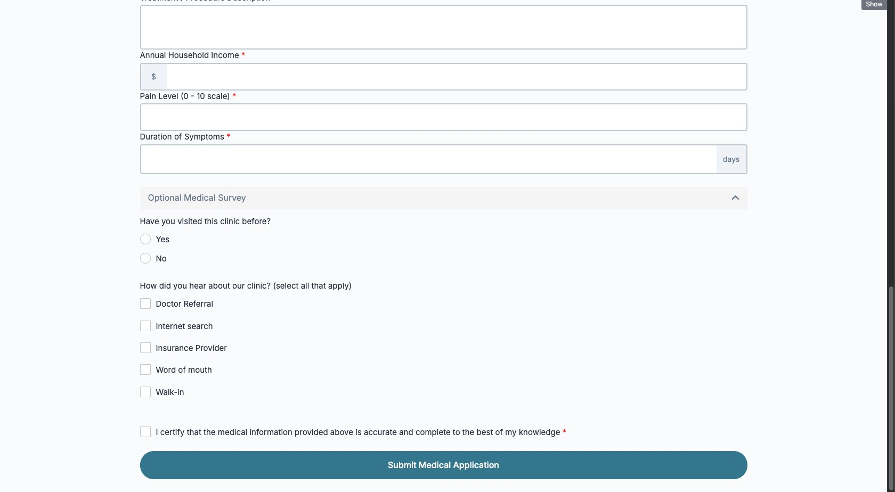

#  Unqork No-Code POC

> A proof-of-concept Patient Medical Application built on the **Unqork enterprise no-code platform** (Centauri 1.0), demonstrating advanced form configuration, conditional business logic, module definition reuse, and multi-section medical data collection.

---

## Project Summary

| Field | Details |
|---|---|
| **Platform** | Unqork Designer (trainingx.unqork.io) |
| **Runtime** | Centauri 1.0 |
| **Module Type** | Front-End |
| **Builder** | Durgesh Tiwari |

---

## Application Architecture

The app consists of a **single Front-End module** inside the `HotelBooking` workspace with four major sections:

```
HotelBooking (Workspace)
└── PatientMedicalApplication (Module)
    │
    ├── Patient Information Section
    │   ├── firstName              → Text Field (Required)
    │   ├── lastName               → Text Field (Required)
    │   ├── dob                    → Date Input (Required)
    │   ├── age                    → Number Field (Auto-calculated, Disabled)
    │   ├── calcAge                → Calculator (MOMENT formula)
    │   ├── ruleCheckAge           → Decision Component (Age validation)
    │   ├── phoneNumber            → Phone Number Field (Required)
    │   ├── email                  → Text Field with Email Validation (Required)
    │   ├── maritalStatus          → Blood Type Dropdown (Required)
    │   ├── usCitizen              → Radio (Do you have health insurance?)
    │   ├── ruleDisplaySSN         → Decision Component (Show/Hide insurance panel)
    │   └── panelSSN               → Panel (Insurance Policy Number — conditional)
    │
    ├── Medical History Section
    │   ├── companyName            → Primary Care Physician Name (Required)
    │   ├── companyWebsite         → Hospital / Clinic Name
    │   ├── businessPhoneNumber    → Emergency Contact Phone Number (Required)
    │   ├── businessType           → Visit Type Dropdown (Required)
    │   └── businessPlan           → Reason for Visit / Symptoms (Required)
    │
    ├── Treatment Request Section
    │   ├── loanAmount             → Estimated Treatment Cost Slider ($0 to $100,000)
    │   ├── loanProposal           → Treatment / Procedure Description (Required)
    │   ├── estimatedAnnualRevenue → Annual Household Income (Required)
    │   ├── creditScore            → Pain Level 0 to 10 Scale (Required)
    │   └── yearsInBusiness        → Duration of Symptoms in Days (Required)
    │
    └── Optional Medical Survey + Confirmation
        ├── radioAppliedBefore     → Have you visited this clinic before?
        ├── ruleLoanAppliedBefore  → Decision (Show/Hide date of last visit)
        ├── dateLastAppliedLoan    → Date of Last Visit (conditional)
        ├── checkboxesHearAboutUs  → How did you hear about us?
        ├── checkboxConfirmation   → Certification Checkbox (Required)
        └── btnSubmit              → Submit Medical Application Button
```

---

## Unqork Concepts Demonstrated

- **Module Definition Reuse** — repurposed an existing application module via Copy/Paste Module Definition, demonstrating cross-project configuration portability
- **Decision Components** — conditional logic to show/hide Insurance Policy Number panel based on health insurance selection
- **Calculator / Transformer** — auto-calculates patient age from Date of Birth using MOMENT formula
- **Accordion Panel** — collapsible Optional Medical Survey section
- **Form Validation** — required field enforcement with red asterisk indicators
- **Dropdown Components** — Blood Type (A+, A-, B+, B-, AB+, AB-, O+, O-, Unknown) and Visit Type with custom data values
- **Phone Number Mask** — formatted input for phone fields
- **Email Validation** — regex pattern validation on email field
- **Range Slider** — Estimated Treatment Cost slider from $0 to $100,000
- **Columns Layout** — two-column responsive form design
- **Express View** — end-user preview and testing

---

## Screenshots
### Total Project

### Patient Information

**Patient Information — top section with Blood Type dropdown and Health Insurance radio**


**Address and additional patient fields**


**Clean Patient Information form view**


---

### Medical History and Treatment Request

**Medical History section — Primary Care Physician, Hospital, Emergency Contact, Visit Type, Symptoms**


**Loan Request and Optional Survey section**


---

### Optional Medical Survey and Submit

**Survey bottom section with checkboxes and submit button**


**Optional Medical Survey with clinic visit history, referral source checkboxes, certification, and Submit Medical Application button**


---

## Repository Structure

```
PatientMedicalApp/
├── README.md
└── assets/
    └── screenshots/
        ├── 01_patient_information_top.png
        ├── 02_address_business_info.png
        ├── 03_loan_request_survey.png
        ├── 04_survey_submit.png
        ├── 05_patient_information_clean.png
        ├── 06_medical_history_treatment.png
        └── 07_survey_submit_medical.png
```

> **To update screenshots:** Replace any image in `assets/screenshots/` keeping the same filename. The README will automatically reference the updated image on GitHub.

---

## How to View

This is a no-code application hosted on Unqork's training environment. There is no local setup required.

1. Access requires a Unqork Academy account at [academy.unqork.com](https://academy.unqork.com)
2. Request training environment access at [unqork.com/academy](https://unqork.com/academy)
3. Log into `trainingx.unqork.io` with your credentials
4. Navigate to the `HotelBooking` workspace and open the `PatientMedicalApplication` module

---

## License

This project is a personal proof-of-concept built for portfolio and learning purposes on the Unqork Academy training environment.
