# 🏨 Hotel Booking App — Unqork No-Code POC

> A proof-of-concept Hotel Booking application built on the **Unqork enterprise no-code platform** (Centauri 1.0), demonstrating end-to-end form configuration, data submission, and multi-module application design.

---

## 📌 Project Summary

| Field | Details |
|---|---|
| **Platform** | Unqork Designer (trainingx.unqork.io) |
| **Runtime** | Centauri 1.0 |
| **Module Type** | Front-End |
| **Builder** | Durgesh Tiwari |
| **Background** | MS Data Science, Indiana University Bloomington |

---

## 🧱 Application Architecture

The app consists of **two Front-End modules** inside the `HotelBooking` workspace:

```
HotelBooking (Workspace)
├── HotelBooking (Module — Guest Registration)
│   ├── firstName          → Text Field (Required)
│   ├── lastName           → Text Field (Required)
│   ├── age                → Text Field
│   ├── phoneNumber        → Text Field (Required)
│   ├── addressSearch      → Address Search Component
│   ├── dateinputStart     → Date Input
│   ├── dateinputEnd       → Date Input
│   ├── rule               → Decision Component
│   └── plugSubmitForm     → Plug-in (Create Module Submission)
│
└── paymentflow (Module — Payment Processing)
    ├── cardHolderFirstName → Text Field (Required)
    ├── cardHolderLastName  → Text Field (Required)
    ├── cardNumber          → Text Field (Required)
    ├── expiryDate          → Date Field (Required)
    ├── cvv                 → Text Field (Required)
    ├── billingAddress      → Address Search Component
    ├── totalAmount         → Number Field (Required)
    ├── paymentMethod       → Dropdown (Required)
    ├── paymentRule         → Decision Component
    └── plugPaymentSubmit   → Plug-in (Create Module Submission)
```

---

## ✅ Unqork Concepts Demonstrated

- **Module Builder** — drag-and-drop component configuration
- **Plug-in Component** — `Create Module Submission(s)` internal service
- **Input Mapping** — 7 fields mapped to Unqork data model
- **Address Search Component** — Google Places API with manual field fallback
- **Form Validation** — required field enforcement
- **Button Component** — Save action type with `Disable on Invalid Forms`
- **Columns Layout** — two-column responsive form design
- **Decision / Rule Component** — conditional business logic
- **Express View** — end-user preview and testing
- **Multi-Module Design** — separate registration and payment flows

---

## 📸 Screenshots

### Module Builder — Guest Registration

**Overview of the HotelBooking module in Unqork Designer**
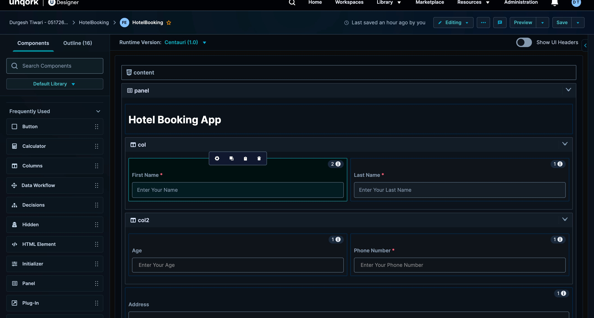

**Address Search and Date components configuration**
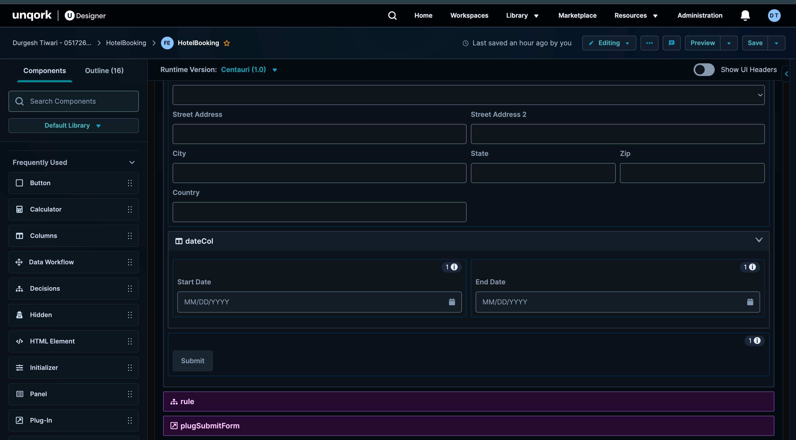

**Final module layout with Submit button and plugSubmitForm**
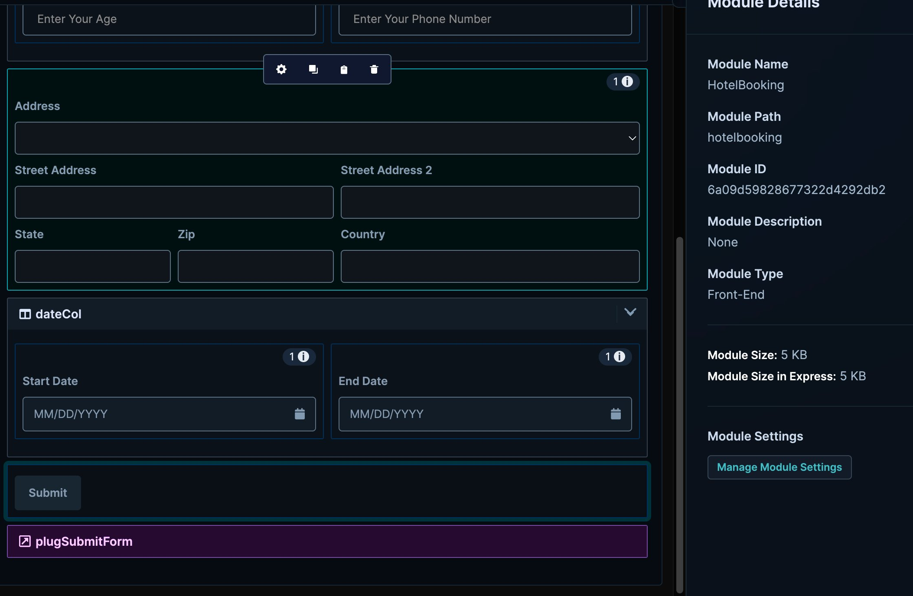

---

### Express View — End User Form

**Top section — Name, Age, Phone Number fields**
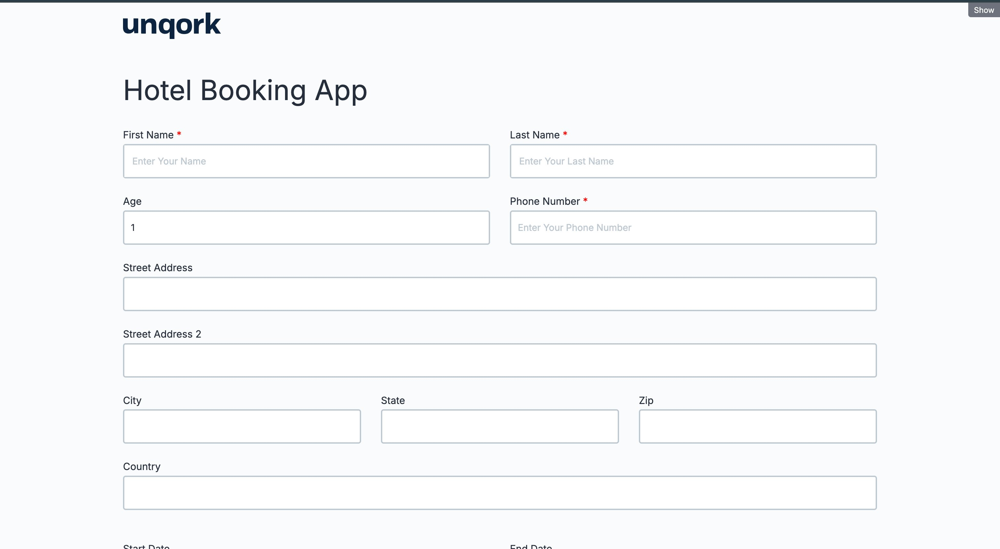

**Bottom section — Address, Dates, Submit button**
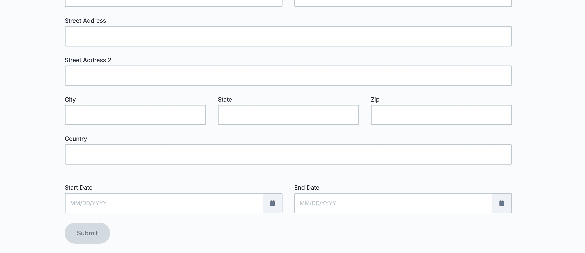

**Form filled with test data**
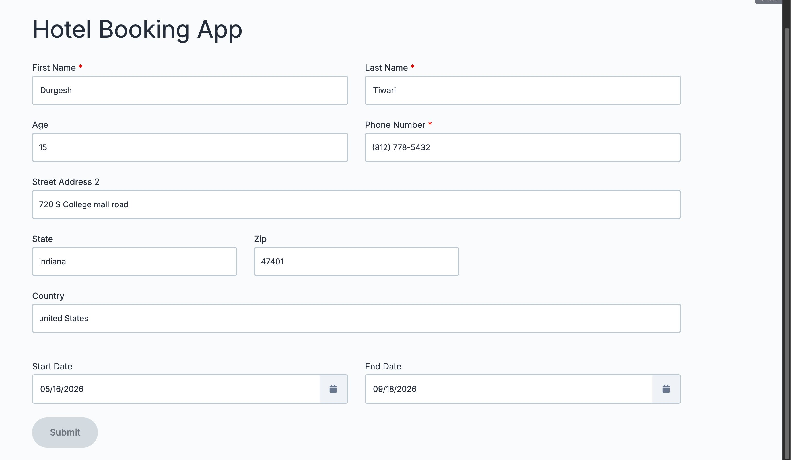

**Full form view**
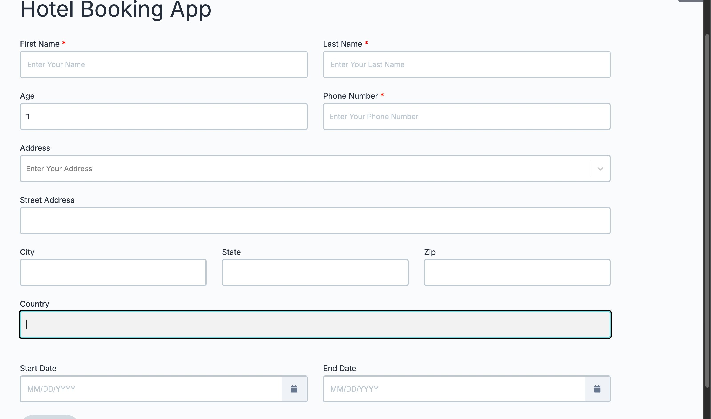

**Address test — manual fields active**
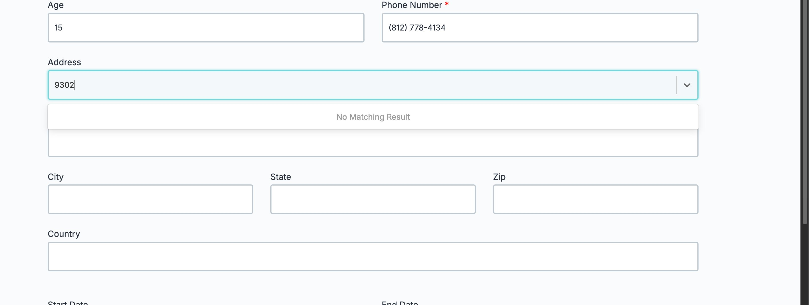

---

### Plug-in Component Configuration

**Service Type and Internal Service selection**
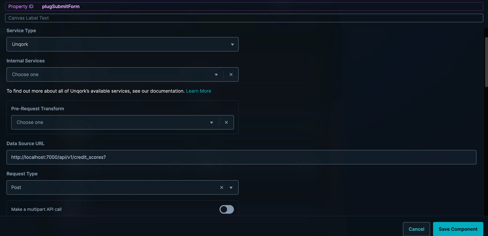

**Internal Service dropdown — Create Module Submission(s) selected**
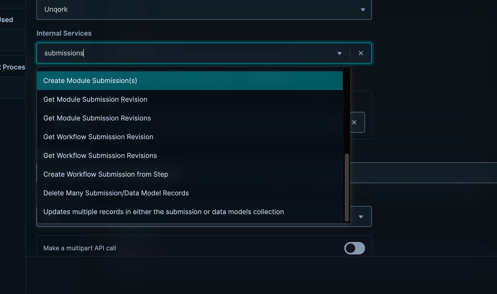

**Data Source URL auto-populated by Unqork**
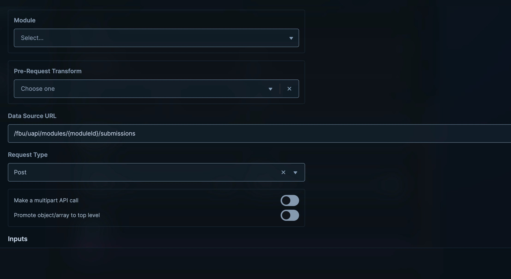

**Input Mapping — all 7 fields mapped to data model**
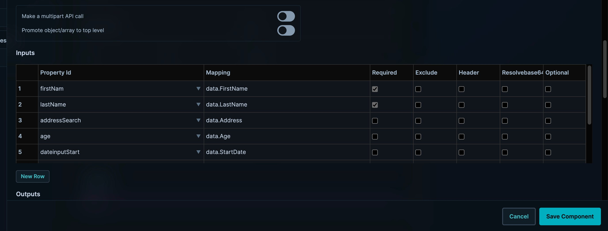

**Extended Input Mapping view (rows 3–7)**
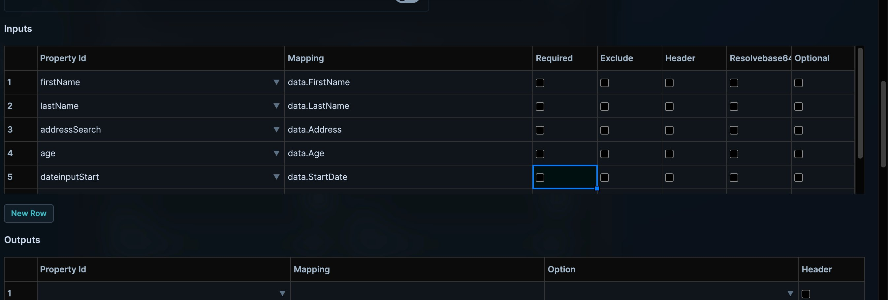

**Complete mapping including End Date and Phone Number**
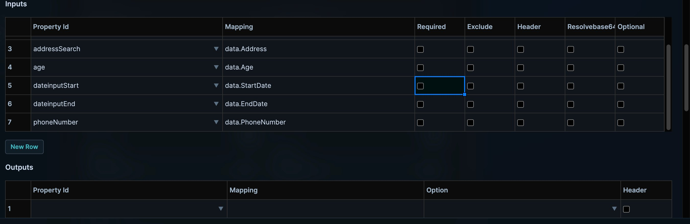

---

### Payment Flow Module

**Payment Information — Card Details section**
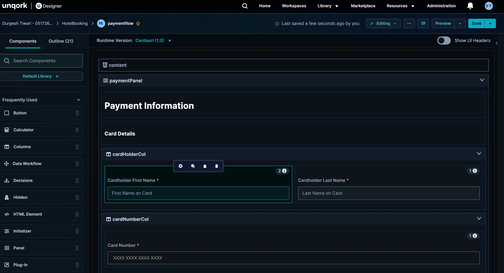

**Billing Address and Payment Summary**
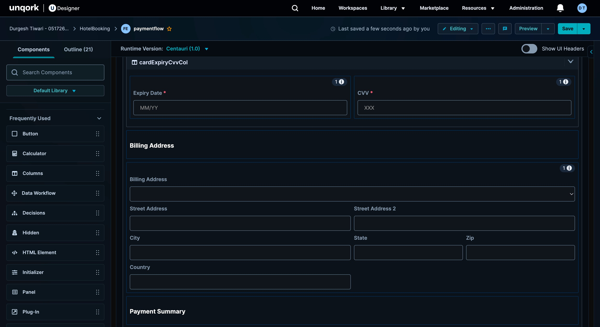

**Payment Summary with Submit Payment button**
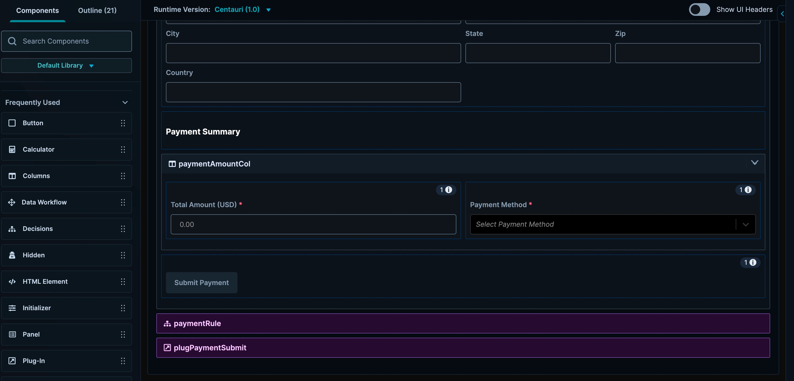

---

## 🗂 Repository Structure

```
HotelBookingApp/
├── README.md
└── assets/
    └── screenshots/
        ├── 01_module_builder_overview.png
        ├── 02_module_builder_address_dates.png
        ├── 03_express_view_top.png
        ├── 04_express_view_bottom.png
        ├── 05_plugin_input_mapping.png
        ├── 06_plugin_input_mapping_full.png
        ├── 07_payment_module_card_details.png
        ├── 08_payment_module_billing.png
        ├── 09_payment_module_summary.png
        ├── 10_plugin_service_config.png
        ├── 11_plugin_internal_service_dropdown.png
        ├── 12_plugin_datasource_url.png
        ├── 13_express_view_address_test.png
        ├── 14_express_view_filled_form.png
        ├── 15_express_view_full_form.png
        ├── 16_module_builder_final.png
        └── 17_plugin_input_mapping_extended.png
```

> **To update screenshots:** Replace any image in `assets/screenshots/` keeping the same filename. The README will automatically reference the updated image on GitHub.

---

## 🚀 How to Run / View

This is a no-code application hosted on Unqork's training environment. There is no local setup required.

1. Access requires a Unqork Academy account at [academy.unqork.com](https://academy.unqork.com)
2. Request training environment access at [unqork.com/academy](https://unqork.com/academy)
3. Log into `trainingx.unqork.io` with your credentials
4. Navigate to the `HotelBooking` workspace to view the modules

---

## 📄 License

This project is a personal proof-of-concept built for portfolio and learning purposes on the Unqork Academy training environment.
